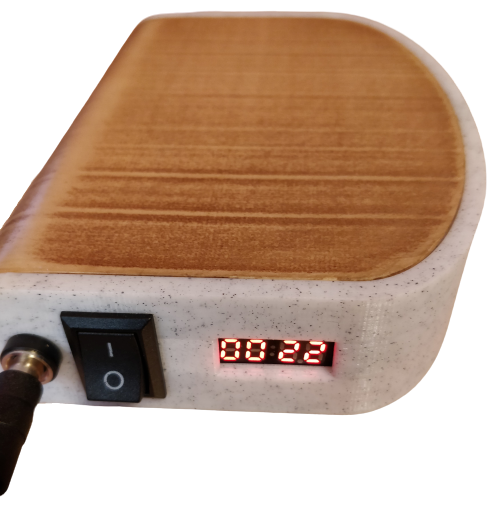
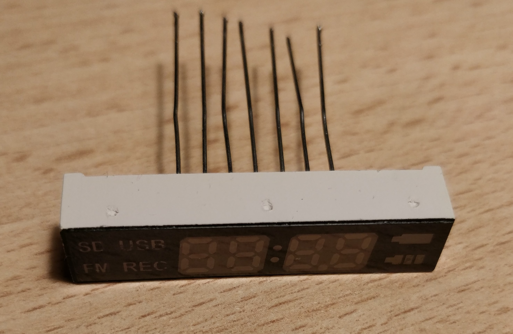
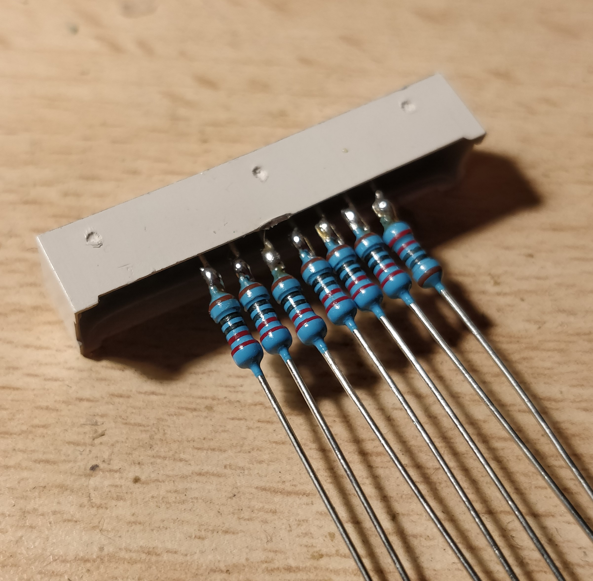
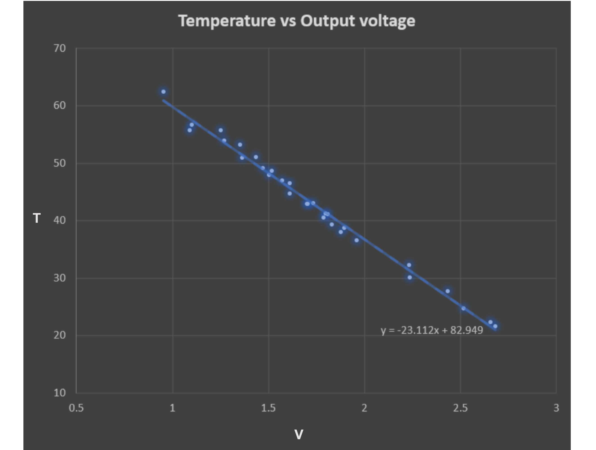
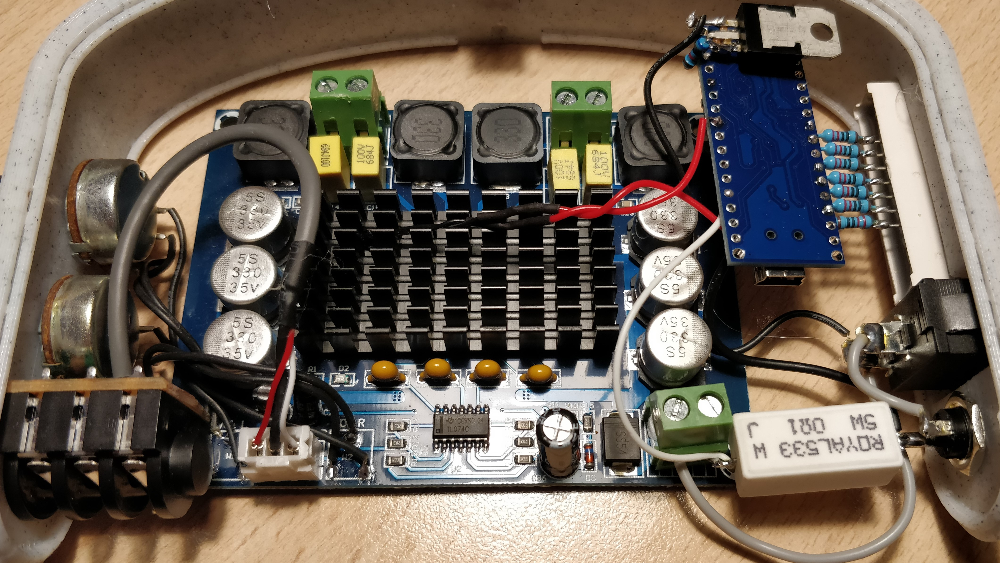
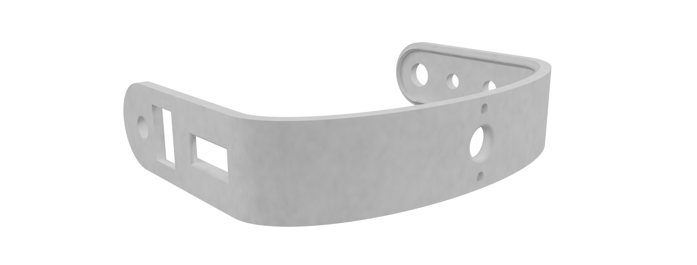
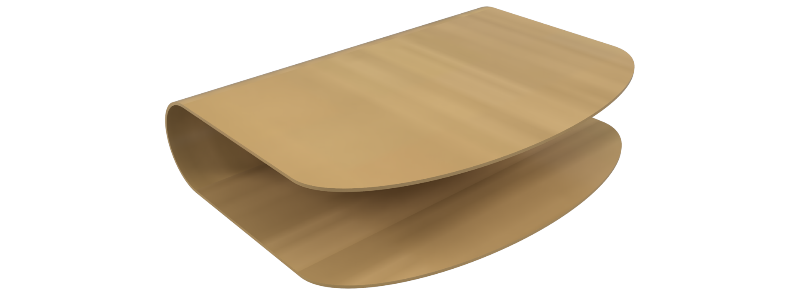
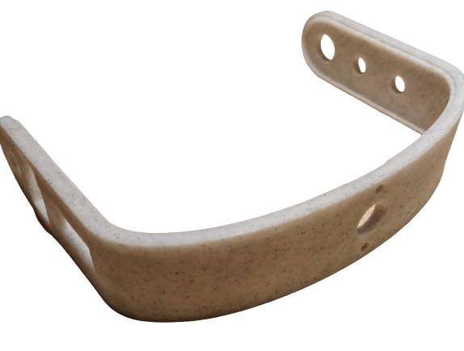
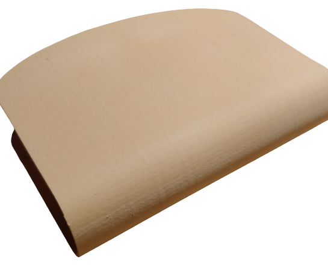
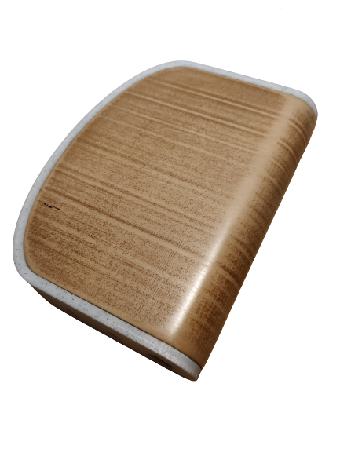

# A TPA3116 & Arduino powered Amp

## Intro

Browsing websites like Aliexpress, it is very easy to find a ton of very cheap, small class-D amplifiers with good power ratings - from sub 0.50€, 3W-capable boards based on a `PAM8403` IC, to 500W `IRS2092S`-based amps for 8€.

Some of these ICs, when coupled with a decent power supply and good quality passives, can offer a remarkable audio quality - it is easy to find many blog posts of audiophiles online claiming performances close to those of amplifiers setups costing thousands of euros. Now, while I am not an audiophile by any stretch of the imagination, I enjoy finding ways to combine my love for electronics and the world of DIY audio - and i have recently got my hands on a couple of old, 30W Yamaha studio monitors which I really wanted to give new life to.

This project's goal is to go from a bare `TPA3116`-based board into a full, standalone amp with Arduino-powered bells and whistles (display with power and temperature monitoring), and show the different hardware and software aspects of the project - it should be relatively easy to adapt to work with different boards or displays.

## Objectives

The `TPA3116` amp can provide over 50W output power per channel with a high enough input voltage, enough to cause the speakers clipping (or in worst case scenario, damage them). Because of this, a way of monitoring the power through the amp will be very useful - as the board I got already has an input op amp that can be used to change the amplification factor, live monitoring of the amp power can allow us to tune the maximum output from the chip using the two volume pots on the board.

For power monitoring, we need a way of measuring input current (and voltage) to provide them to the Arduino - a low value shunt and a resistor divider combined with a couple of analog inputs from the chip will do that nicely.

We also need a way of displaying that information - while looking though a pile of old electronic boards I found a 4 digits 7-segment display which would be perfect for the job. The display only has 7 connectors, so a bit of reverse engineering will be needed to make it work.

We also don't want to have just a mess of wires dangling from the amp, so i will design a 3D printed enclosure. As this could cause some problems with air flow on the amp heatsink, I chose to add temperature sensing with a PTC thermistor to the board, and display also this information of the screen.

# Hardware

## Power sensing

In order to estimate the instantenous power to the amplifier we obviously need voltage and current sensing. 
Voltage sensing is easy enough - a resistor divider is all we need to sense the input voltage with an analog pin of the Arduino. As I like to have the things I build catch on fire only after the main part of the system is gone for good, this will be sized in order to allow for a slightly higher input voltage with respect to the absolute maximum rating for the TPA3116. Datasheet tells us that with >30V at the input the chip is as useful as a paperweight, so we'll use this as a guideline.

As the arduino ADC can only go up to Vcc, and our Vcc will be 5V, we will use a divider made from a 27K ohms  to Vin and 5.1K ohms to gnd.

For current sensing I chose to use a single shunt resistor, without a current sense amplifier, to keep component count low. Using a 0.1 Ohms resistor, when running at the maximum power of 60W (~3A from a 20V supply), we will have a voltage drop of 0.3V on the shunt. With a ~4.9mV analog resolution from the Arduino we will have a ~50mA sensitivity, good enough for our application. We'll use a low side sensing configuration, where the shunt is placed between the amp's negative terminal and gnd. While high side sensing would be a better choice, this would require additional components and complexity (measuring a small voltage differential between two signals with a large common mode signal) - so a current sense amplifier would be preferred (two voltage dividers could be used but this would require very high precision resistors and resolution would be limited by the ATmega 10 bit adc).

## Reverse engineering the 7 segment display

As you can see from the picture above, the display I chose only has 7 connections to drive the icons and 4 7-segment digits. By soldering a resistor to each pin and poking around I found that this is not the usual common anode or cathode display - instead almost each combination of the pins lit up a different segment. To make things more complex, _switching the polarity_ between two pins lit up different segments. I started by soldering resistors to all pins of the display

Then, helped by an Excel spreadsheet, I mapped each led segment of each display digit to the correct pair of pins (e.g. segment A of the first digit means positive on pin 1 and negative on pin 4).

Given how the display works, it is impossible to light up multiple segments at the same time (without at least causing some unwanted ones to light up as well), so multiplexing is our only option in driving the display. This means that in order to display a digit, we will need to light up each segment for a fraction of a millisecond, then the next and so on.

More in detail, knowing the correct sequence of segments, we need to:
1. Set all display pins to `high impedence` (`INPUT` in Arduino language) - so no significan current can flow through the display and light it up
2. Set the correct first pair of pins to output a high and low voltage level (pin mode to `OUTPUT` and set to `HIGH` and `LOW` for Arduino)
3. Wait for a small amount of time (500us will result in a refresh time of ~14ms when we need to display four 8's, so a minimum refresh rate of ~71 frames per second, enough for the human eye to do its thing and perceive a fixed image)
4. Start again for the next pair of pins

# Temperature sensing

For temperature sensing, I used a random PTC thermistor I got from a Li-Ion protection board. The `TPA3116` IC already contains temperature protection and should shut down the output after reaching a junction temperature of ~150C, but I really am not comfortable just knowing that my amp is colder than 150C... also, a 3D printed case would start metling far below that. So, our beautiful reverse engineered display will need to also tell us the current temperature.

Now, in order to use a random PTC found laying around wihtout knowing anything about it we have multiple options:
- Find a datasheet starting from data about the board we stole it from/ markings on the thermistor itself (mine was blank)
- Trying to characterize it analytically (a PTC resistance depends on temperature as , so with a couple of measurments we should be able to obtain the three parameters B, R0 and T0 we need)

- Being lazy, mounting it to the heatsink, heating the heatsink with a hot air gun and using Excel for interpolating the results

While the last option is the one that sounds the worst, in our case it's actually the best option - it's fast, easy, and we consider the behaviour of the whole system (from heatsink temperature to output voltage of the resistor divider containing the PTC) instead of only characterizing the PTC itself. And, we are not interested in a sub-1C accuracy.

By plotting some output voltages at different heatsink temperatures we obtain an almost linear relation:

So we'll use this relation to estimate the current temperature (this is obtained by using the PTC in a voltage divider with a 5.1K resistor to gnd).

# Power scheme

While powering the system seems trivial, there are a couple of points to address:
- As we are using low side current sensing and the arduino adc needs a positive voltage, we will supply the arduino directly from the Vin connector, while the amp ground will be connected to Vin through the 0.1Ohms shunt. this means that the ground references of the two circuits will be different - not a problem for our application, but if we wanted, for example, to mute the amp or change the volume from the arduino, this setup would not allow it

- The `AMS1117` LDO that provides the 5V to the arduino can only be supplied with up to 15V. We will cascade it after another linear regulator in order to allow for higher input voltages and split the power dissipation. In particular, I used an `LM317` before the Vin pins of the Arduino, set to output ~10V, in order to split the power dissipation between the 2 regulators as 2/3 on the `LM317` (the TO220 package is a lot more efficient at dissipating power with respect to the SOT package of the integrated LDO), and 1/3 on the `AMS1117`

The above picture shows the internals of the amp, with the arduino on the right side, the amp in the center and right and left volume potentiometers, together with the input 5mm jack connected to the outside frame.

# Enclosure

Ok, so last thing missing is an anclosure for the electronics. I desigend it in Fusion360 as 2 separate pieces - a frame where electronics are mounted (you see it in the previous image) and a cover for the electronics.

The frame was printed in marble PLA, and the external cover in wood-filled filament. Printing took around 5 hours, with the majority of the time required by the outer frame. The files for printing are in the GitHub repository for the project.

After a bit of post processing, sanding and waxing, the enclosure goes from looking like a quick prototype to almost wood like.

# Software

I'm using VSCode with the PlatformIO extension to write all my code for embedded platforms. Seriously, while leaving the Arduino IDE might look scary, it will look unusable after giving Pio a try. Also, it provides a very easy way to compile and debug code for a huge variety of platforms, like STM32 MCUs, ESP boards, bluetooth-enabled nRF MCUs and many more... no more `Serial.print("here")` for debugging Arduino code, or messing with ugly Eclipse skinned proprietary IDEs.

The code itself is pretty simple, and split into 3 files:

- main.cpp, with the main application loop - read the current, voltage and temperature, apply a mean filter on current (as it varies very rapidly), and display to the display

- Segm.cpp, the driver for the seven segment display implementing the controlling strategy defined above. It implements functions to light up a single segment, show digits and a short test routine to check that the display is hooked up and working properly

- Sense.cpp, with the three functions used to obtain the current, temperature and voltage from three analog readings 

# End Result

.png)
.png)
.png)

